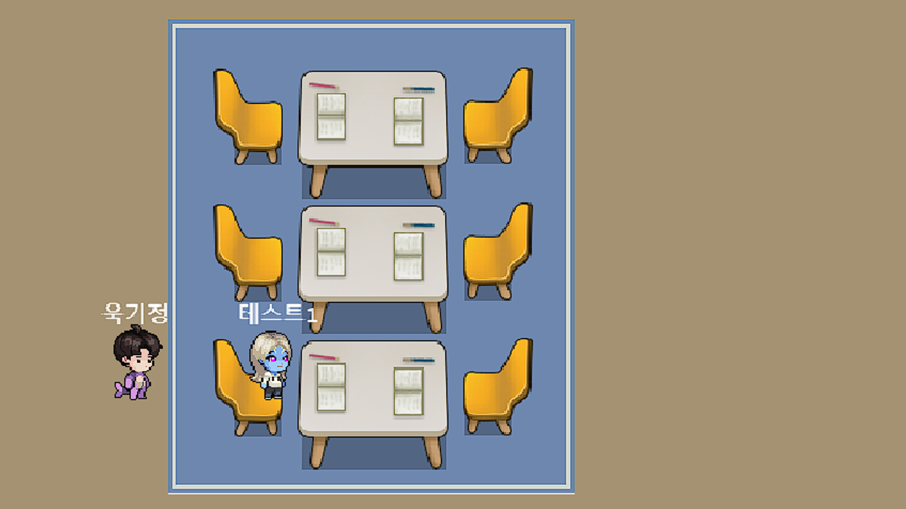
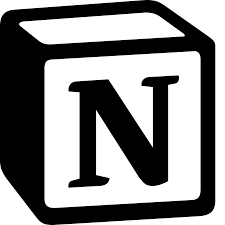
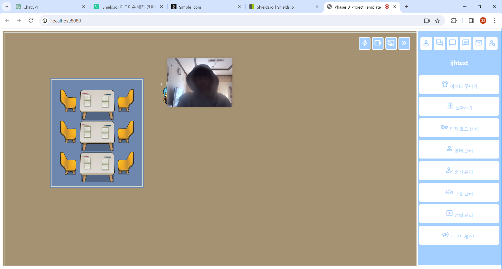
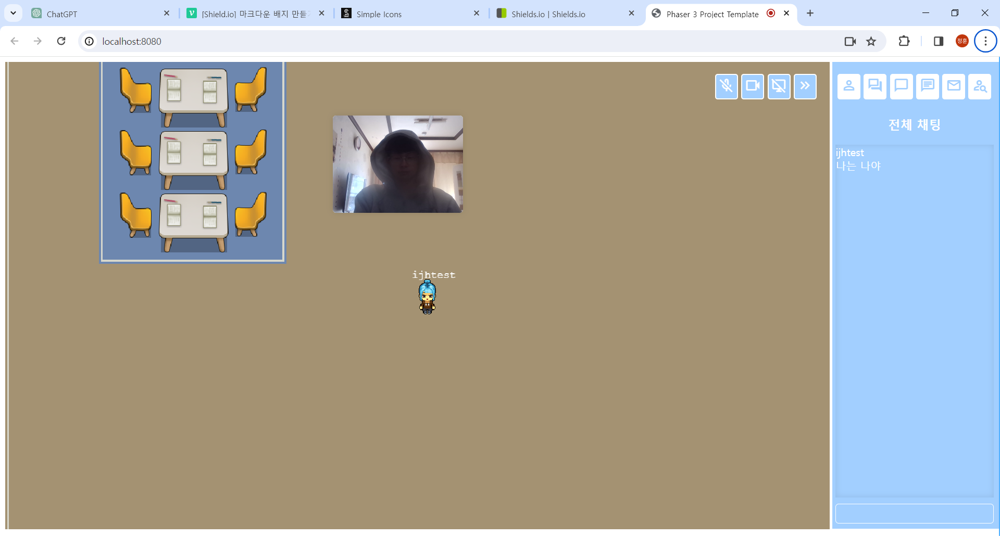
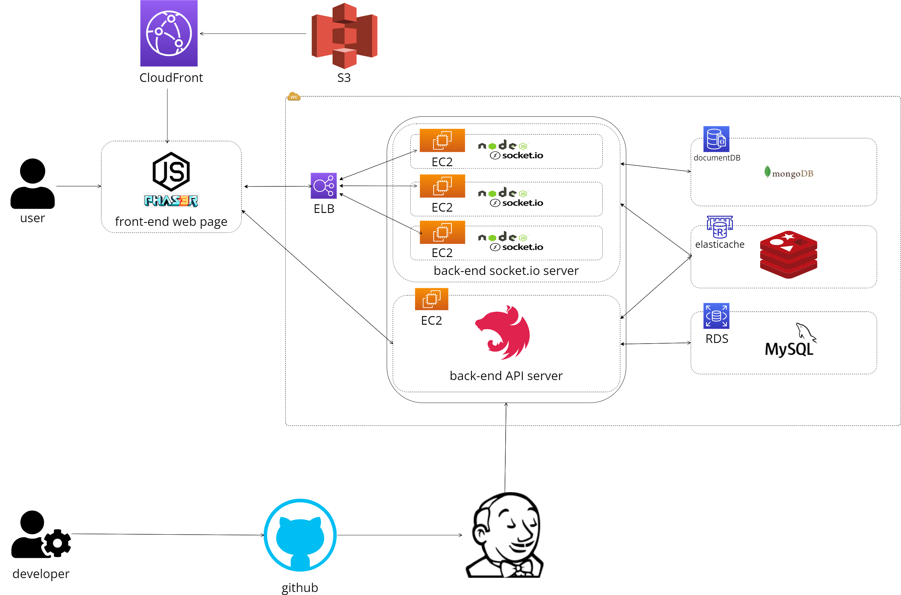

<h1 style='display:flex;align-items:center;'>

study_camp
</h1>

  

  
    
    &nbsp; &nbsp; &nbsp; &nbsp; &nbsp; &nbsp; &nbsp; &nbsp; &nbsp; &nbsp; &nbsp; &nbsp;
    
    &nbsp; &nbsp; &nbsp; &nbsp; &nbsp; &nbsp; &nbsp; &nbsp; &nbsp; &nbsp; &nbsp; &nbsp;
    
  

  사이트 바로가기
  &nbsp; &nbsp; &nbsp; &nbsp; &nbsp; &nbsp;
  study_camp 기획안
  &nbsp; &nbsp; &nbsp; &nbsp; &nbsp; &nbsp;
  study_camp 브로셔
    

  

<h2>👉 프로젝트 소개</h2>

온라인 메타버스에서 모여 공부를 하는 트렌드가 생기며  사용자들은  <b>학습</b>에 특화된 메타버스 환경을 원했습니다.
  
이런 사용자들의 요구에 따라 
<b>학습에 특화된 메타버스 환경을</b> 제공합니다.

 

<h3 align='center' style="color:#27AAE1;">
<b>🤔study_camp를 왜 써야 하나요?</b>
</h3>

게더나 젭과 같은 온라인 메타버스 환경 같은 경우 학습을 하는데 도움을 주지만 학습 자체를 효율적으로 하는데는 특화되지 못했습니다.
  
따라서, <b>학습을 효율적으로</b>할 수 있고 <b>학습에 대한 모니터링도</b> 가능한 학습 특화 메타버스를 만들고자 합니다.
  
<b>🎉study_camp가 여러분의 발전에 도움이 되었으면 합니다!🎉</b>

 

<h2> 🖥 화면 구현 </h2>
<table border="3">
  <tbody>
  <tr align="center">
    <td colspan=3><b>이미지를 클릭하면 크게 볼 수 있습니다!</b></td>
  </tr>
  <tr align="center">
    <td width="300">로그인 페이지</td>
    <td width="300">학습 공간 접속 페이지</td>
    <td width="300">학습 공간 페이지</td>
  </tr>
  <tr>
    <td></td>
    <td></td>
    <td></td>
  </tr>
  <tr align="center">
    <td>화상 전화</td>
    <td>채팅</td>
    <td>미정</td>
  </tr>
  <tr>
    <td></td>
    <td></td>
    <td></td>
  </tr>
  </tbody>
</table>
  

 

<h2> 👏 프로젝트 참여 인원 </h2>
<table border="3">
  <tbody><tr align="center">
  </tr>
  <tr align="center">
  <td width="300">강다형</td>
  <td width="300">배윤호</td>
  <td width="300">정기욱</td>
  <td width="300">이정훈</td>
  </tr>
  <tr>
    <td>
      

        
      

    </td>
    <td>
      

        
      

    </td>
    <td>
      

        
      

    </td>
    <td>
      

        
      

    </td>
  </tr>
  <tr align="center">
    <td>
      <a href="https://github.com/daink" target="_blank" rel="noopener noreferrer">
        @daink
      </a>
    </td>
    <td>
      <a href="https://github.com/pachyuchepe" target="_blank" rel="noopener noreferrer">
        @PachyuChepe
      </a>
    </td>
    <td>
      <a href="https://github.com/heyfuxkingcheez" target="_blank" rel="noopener noreferrer">
        @heyfuxkingcheez
      </a>
    </td>
    <td>
      <a href="https://github.com/wlals7565" target="_blank" rel="noopener noreferrer">
        @wlals7565
      </a>
    </td>
  </tr>
  <tr align="center">
    <td>
      수행한 작업  
      수행한 작업  
      수행한 작업  
      수행한 작업  
      수행한 작업  
    </td>
    <td>
      수행한 작업  
      수행한 작업  
      수행한 작업  
      수행한 작업  
      수행한 작업  
    </td>
    <td>
      수행한 작업  
      수행한 작업  
      수행한 작업  
      수행한 작업  
      수행한 작업  
    </td>
    <td>
      수행한 작업  
      수행한 작업  
      수행한 작업  
      수행한 작업  
      수행한 작업  
    </td>
  </tr>
</tbody></table>

  

<h2 tabindex="-1" dir="auto"><a id="user-content--기술-스택" class="anchor" aria-hidden="true" href="#-기술-스택"><svg class="octicon octicon-link" viewBox="0 0 16 16" version="1.1" width="16" height="16" aria-hidden="true"><path d="m7.775 3.275 1.25-1.25a3.5 3.5 0 1 1 4.95 4.95l-2.5 2.5a3.5 3.5 0 0 1-4.95 0 .751.751 0 0 1 .018-1.042.751.751 0 0 1 1.042-.018 1.998 1.998 0 0 0 2.83 0l2.5-2.5a2.002 2.002 0 0 0-2.83-2.83l-1.25 1.25a.751.751 0 0 1-1.042-.018.751.751 0 0 1-.018-1.042Zm-4.69 9.64a1.998 1.998 0 0 0 2.83 0l1.25-1.25a.751.751 0 0 1 1.042.018.751.751 0 0 1 .018 1.042l-1.25 1.25a3.5 3.5 0 1 1-4.95-4.95l2.5-2.5a3.5 3.5 0 0 1 4.95 0 .751.751 0 0 1-.018 1.042.751.751 0 0 1-1.042.018 1.998 1.998 0 0 0-2.83 0l-2.5 2.5a1.998 1.998 0 0 0 0 2.83Z"></path></svg></a><g-emoji class="g-emoji" alias="gear" fallback-src="https://github.githubassets.com/images/icons/emoji/unicode/2699.png">⚙</g-emoji> 기술 스택</h2>
<h3 tabindex="-1" dir="auto"><a id="user-content--frond-end" class="anchor" aria-hidden="true" href="#-frond-end"><svg class="octicon octicon-link" viewBox="0 0 16 16" version="1.1" width="16" height="16" aria-hidden="true"><path d="m7.775 3.275 1.25-1.25a3.5 3.5 0 1 1 4.95 4.95l-2.5 2.5a3.5 3.5 0 0 1-4.95 0 .751.751 0 0 1 .018-1.042.751.751 0 0 1 1.042-.018 1.998 1.998 0 0 0 2.83 0l2.5-2.5a2.002 2.002 0 0 0-2.83-2.83l-1.25 1.25a.751.751 0 0 1-1.042-.018.751.751 0 0 1-.018-1.042Zm-4.69 9.64a1.998 1.998 0 0 0 2.83 0l1.25-1.25a.751.751 0 0 1 1.042.018.751.751 0 0 1 .018 1.042l-1.25 1.25a3.5 3.5 0 1 1-4.95-4.95l2.5-2.5a3.5 3.5 0 0 1 4.95 0 .751.751 0 0 1-.018 1.042.751.751 0 0 1-1.042.018 1.998 1.998 0 0 0-2.83 0l-2.5 2.5a1.998 1.998 0 0 0 0 2.83Z"></path></svg></a><g-emoji class="g-emoji" alias="heavy_check_mark" fallback-src="https://github.githubassets.com/images/icons/emoji/unicode/2714.png">✔</g-emoji> Front-end</h3>

<h3 tabindex="-1" dir="auto"><a id="user-content--back-end" class="anchor" aria-hidden="true" href="#-back-end"><svg class="octicon octicon-link" viewBox="0 0 16 16" version="1.1" width="16" height="16" aria-hidden="true"><path d="m7.775 3.275 1.25-1.25a3.5 3.5 0 1 1 4.95 4.95l-2.5 2.5a3.5 3.5 0 0 1-4.95 0 .751.751 0 0 1 .018-1.042.751.751 0 0 1 1.042-.018 1.998 1.998 0 0 0 2.83 0l2.5-2.5a2.002 2.002 0 0 0-2.83-2.83l-1.25 1.25a.751.751 0 0 1-1.042-.018.751.751 0 0 1-.018-1.042Zm-4.69 9.64a1.998 1.998 0 0 0 2.83 0l1.25-1.25a.751.751 0 0 1 1.042.018.751.751 0 0 1 .018 1.042l-1.25 1.25a3.5 3.5 0 1 1-4.95-4.95l2.5-2.5a3.5 3.5 0 0 1 4.95 0 .751.751 0 0 1-.018 1.042.751.751 0 0 1-1.042.018 1.998 1.998 0 0 0-2.83 0l-2.5 2.5a1.998 1.998 0 0 0 0 2.83Z"></path></svg></a><g-emoji class="g-emoji" alias="heavy_check_mark" fallback-src="https://github.githubassets.com/images/icons/emoji/unicode/2714.png">✔</g-emoji> Back-end</h3>

<h3 tabindex="-1" dir="auto"><a id="user-content--back-end" class="anchor" aria-hidden="true" href="#-back-end"><svg class="octicon octicon-link" viewBox="0 0 16 16" version="1.1" width="16" height="16" aria-hidden="true"><path d="m7.775 3.275 1.25-1.25a3.5 3.5 0 1 1 4.95 4.95l-2.5 2.5a3.5 3.5 0 0 1-4.95 0 .751.751 0 0 1 .018-1.042.751.751 0 0 1 1.042-.018 1.998 1.998 0 0 0 2.83 0l2.5-2.5a2.002 2.002 0 0 0-2.83-2.83l-1.25 1.25a.751.751 0 0 1-1.042-.018.751.751 0 0 1-.018-1.042Zm-4.69 9.64a1.998 1.998 0 0 0 2.83 0l1.25-1.25a.751.751 0 0 1 1.042.018.751.751 0 0 1 .018 1.042l-1.25 1.25a3.5 3.5 0 1 1-4.95-4.95l2.5-2.5a3.5 3.5 0 0 1 4.95 0 .751.751 0 0 1-.018 1.042.751.751 0 0 1-1.042.018 1.998 1.998 0 0 0-2.83 0l-2.5 2.5a1.998 1.998 0 0 0 0 2.83Z"></path></svg></a><g-emoji class="g-emoji" alias="heavy_check_mark" fallback-src="https://github.githubassets.com/images/icons/emoji/unicode/2714.png">✔</g-emoji> Database</h3>

<h3 tabindex="-1" dir="auto"><a id="user-content--dev-tools" class="anchor" aria-hidden="true" href="#-dev-tools"><svg class="octicon octicon-link" viewBox="0 0 16 16" version="1.1" width="16" height="16" aria-hidden="true"><path d="m7.775 3.275 1.25-1.25a3.5 3.5 0 1 1 4.95 4.95l-2.5 2.5a3.5 3.5 0 0 1-4.95 0 .751.751 0 0 1 .018-1.042.751.751 0 0 1 1.042-.018 1.998 1.998 0 0 0 2.83 0l2.5-2.5a2.002 2.002 0 0 0-2.83-2.83l-1.25 1.25a.751.751 0 0 1-1.042-.018.751.751 0 0 1-.018-1.042Zm-4.69 9.64a1.998 1.998 0 0 0 2.83 0l1.25-1.25a.751.751 0 0 1 1.042.018.751.751 0 0 1 .018 1.042l-1.25 1.25a3.5 3.5 0 1 1-4.95-4.95l2.5-2.5a3.5 3.5 0 0 1 4.95 0 .751.751 0 0 1-.018 1.042.751.751 0 0 1-1.042.018 1.998 1.998 0 0 0-2.83 0l-2.5 2.5a1.998 1.998 0 0 0 0 2.83Z"></path></svg></a><g-emoji class="g-emoji" alias="heavy_check_mark" fallback-src="https://github.githubassets.com/images/icons/emoji/unicode/2714.png">✔</g-emoji> DevOps</h3>

<h3 tabindex="-1" dir="auto"><a id="user-content--dev-tools" class="anchor" aria-hidden="true" href="#-dev-tools"><svg class="octicon octicon-link" viewBox="0 0 16 16" version="1.1" width="16" height="16" aria-hidden="true"><path d="m7.775 3.275 1.25-1.25a3.5 3.5 0 1 1 4.95 4.95l-2.5 2.5a3.5 3.5 0 0 1-4.95 0 .751.751 0 0 1 .018-1.042.751.751 0 0 1 1.042-.018 1.998 1.998 0 0 0 2.83 0l2.5-2.5a2.002 2.002 0 0 0-2.83-2.83l-1.25 1.25a.751.751 0 0 1-1.042-.018.751.751 0 0 1-.018-1.042Zm-4.69 9.64a1.998 1.998 0 0 0 2.83 0l1.25-1.25a.751.751 0 0 1 1.042.018.751.751 0 0 1 .018 1.042l-1.25 1.25a3.5 3.5 0 1 1-4.95-4.95l2.5-2.5a3.5 3.5 0 0 1 4.95 0 .751.751 0 0 1-.018 1.042.751.751 0 0 1-1.042.018 1.998 1.998 0 0 0-2.83 0l-2.5 2.5a1.998 1.998 0 0 0 0 2.83Z"></path></svg></a><g-emoji class="g-emoji" alias="heavy_check_mark" fallback-src="https://github.githubassets.com/images/icons/emoji/unicode/2714.png">✔</g-emoji> 협업툴</h3>

  

<h2 tabindex="-1" dir="auto"><a id="user-content--프로젝트-아키텍쳐" class="anchor" aria-hidden="true" href="#-프로젝트-아키텍쳐"><svg class="octicon octicon-link" viewBox="0 0 16 16" version="1.1" width="16" height="16" aria-hidden="true"><path d="m7.775 3.275 1.25-1.25a3.5 3.5 0 1 1 4.95 4.95l-2.5 2.5a3.5 3.5 0 0 1-4.95 0 .751.751 0 0 1 .018-1.042.751.751 0 0 1 1.042-.018 1.998 1.998 0 0 0 2.83 0l2.5-2.5a2.002 2.002 0 0 0-2.83-2.83l-1.25 1.25a.751.751 0 0 1-1.042-.018.751.751 0 0 1-.018-1.042Zm-4.69 9.64a1.998 1.998 0 0 0 2.83 0l1.25-1.25a.751.751 0 0 1 1.042.018.751.751 0 0 1 .018 1.042l-1.25 1.25a3.5 3.5 0 1 1-4.95-4.95l2.5-2.5a3.5 3.5 0 0 1 4.95 0 .751.751 0 0 1-.018 1.042.751.751 0 0 1-1.042.018 1.998 1.998 0 0 0-2.83 0l-2.5 2.5a1.998 1.998 0 0 0 0 2.83Z"></path></svg></a><g-emoji class="g-emoji" alias="hammer_and_wrench" fallback-src="https://github.githubassets.com/images/icons/emoji/unicode/1f6e0.png">🛠</g-emoji> 프로젝트 아키텍쳐</h2>

  

<h2><g-emoji class="g-emoji" alias="memo" fallback-src="https://github.githubassets.com/images/icons/emoji/unicode/1f4dd.png">📝</g-emoji>기술적 의사 결정 </h2>

<table>
<thead>
<tr>
<th align="left"><strong>기술 스택</strong></th>
<th align="left"><strong>사용이유</strong></th>
</tr>
</thead>
<tbody>
<tr>
<td align="left">템플릿</td>
<td align="left">
  <ul>
    <li>
      템플릿 내용
    </li>
    <li>
      템플릿 내용
    </li>
    <li>
      템플릿 내용
    </li>
  </ul>
  </td>
</tr>
<tr>
<td align="left">Phaser</td>
<td align="left">
  <ul>
    <li>
      HTML5 기반의 게임 개발 프레임워크입니다.
    </li>
    <li>
      자바스크립트를 지원합니다. 백엔드 서버도 자바스크립트를 쓰기 때문에 일관성을 유지할 수 있습니다. 생산성도 향상됩니다.
    </li>
    <li>
      Phaser는 커뮤니티가 타 JS기반 게임 개발 프레임워크 보다 크기 때문에 쉽게 자료를 구할 수 있습니다.
    </li>
  </ul>
  </td>
</tr>
<tr>
<td align="left">NestJS</td>
<td align="left">
  <ul>
    <li>
      NestJS는 서버 사이드 애플리케이션 구축을 지원하는 프레임워크입니다.
    </li>
    <li>
      API를 작성하는데 있어서 모듈화된 코드 작성과 유지보수를 위한 효율적인 도구를 제공합니다.
    </li>
  </ul>
  </td>
</tr>
<tr>
<td align="left">TypeORM</td>
<td align="left">
   <ul>
    <li> 
      객체와 데이터베이스를 매핑해줍니다. 
    </li>
    <li>
      Repository 패턴을 사용하여 코드를 구조화하기 편리합니다.
    </li>
    <li>
      다양한 관계를 지원하고, 관계를 더 쉽게 조작하기 위해 많은 기능을 제공해 줍니다.
    </li>
  </ul>
 </td>
</tr>
<tr>
<td align="left">Axios</td>
<td align="left">
  <ul>
    <li> 
      비동기 HTTP 통신 라이브러리입니다.
    </li>
    <li>
      프론트에서 API서버와 통신을 편리하게 해줍니다.
    </li>
  </ul>
 </td>
</tr>
<tr>
<td align="left">socket.io</td>
<td align="left">
  <ul>
    <li>
      socket.io는 실시간 양방향 통신 라이브러리입니다.
    </li>
    <li>
      온라인 메타버스에서는 실시간으로 왔다 갔다 해야할 데이터가 많습니다. socket.io는 이러한 데이터를 처리하는데 특화되어 있습니다.
    </li>
  </ul>
  </td>
</tr>
<tr>
<td align="left">webRTC</td>
<td align="left">
  <ul>
    <li>
      애플리케이션에 실시간 통신 기능을 추가해줍니다.
    </li>
    <li>
      사용자가 카메라와 마이크를 사용하여 통신할 수 있게 만들어줍니다.
    </li>
  </ul>
  </td>
</tr>
<tr>
<td align="left">Redis</td>
<td align="left">
   <ul>
   <li>
   인메모리 저장소를 지원하기 때문에 빠른 읽기 쓰기가 가능합니다.
   </li>
    <li> 
      또한 Pub/Sub을 지원하기 때문에 socket.io를 사용하는 동일한 서버를 여러개 두었을 때 동기화를 도와줍니다.
    </li>
  </ul>
</td>
</tr>
<tr>
<td align="left">AWS</td>
<td align="left">
  <ul>
    <li>
      AWS는 클라우드 서비스를 지원하며 이와 관련된 많은 도구들이 존재합니다.
    </li>
    <li>
      AWS에서 지원하는 도구들을 통해 서버와 데이터베이스에 대해서 고가용성, 확장성, 안정성 등을 확보할 수 있습니다.
    </li>
  </ul>
  </td>
</tr>
</tbody>
</table>

<h2>🔎 주요 기능</h2>

  <ul>
    <li>
    PassportStrategy를 통해 구글 인증 전략을 구현했습니다. 
    구글 계정으로 회원가입과 로그인이 가능합니다.
    </li>
      <image src="./src/public/구글 로그인.png"></image>
  </ul>
  

    구글 로그인 구현
  

  <ul>
    <li>
    Socket.io를 통해 실시간 채팅을 구현했습니다. 
    전체 채팅과 다이렉트 메시지를 지원합니다. 
    과거의 채팅도 볼 수 있습니다. 
    </li>
      <image src="./src/public/다이렉트 메세지.png"></image>
  </ul>
  

    채팅 구현
  

  <ul>
    <li>
    사진필요! 
    Socket.io와 WebRTC를 이용해 실시간 화상채팅을 구현했습니다.
    </li>
      <image src=""></image>
  </ul>
  

    화상채팅 구현
  

  <ul>
    <li>
    온라인 메타버스를 생성할 때 결제기능을 구현했습니다. 
    토스페이먼츠의 API를 이용하였습니다.
    </li>
      <image src="./src/public/토스 결제창.png"></image>
  </ul>
  

    토스 페이먼츠 결제 기능 구현
  

